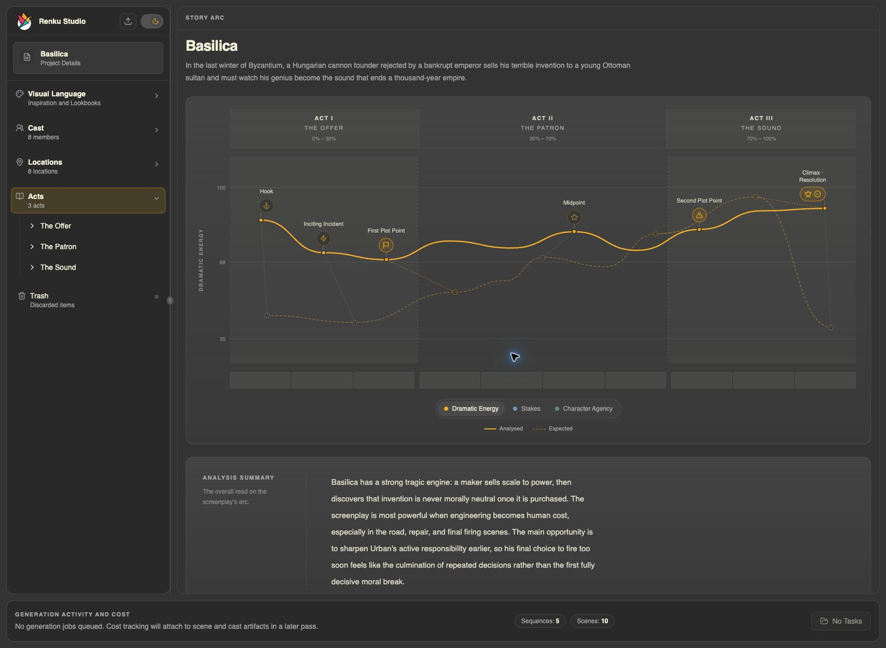
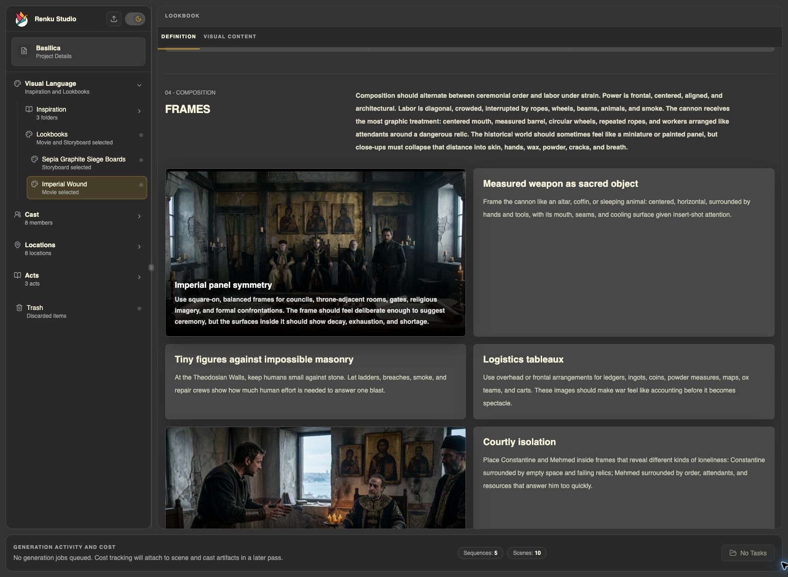
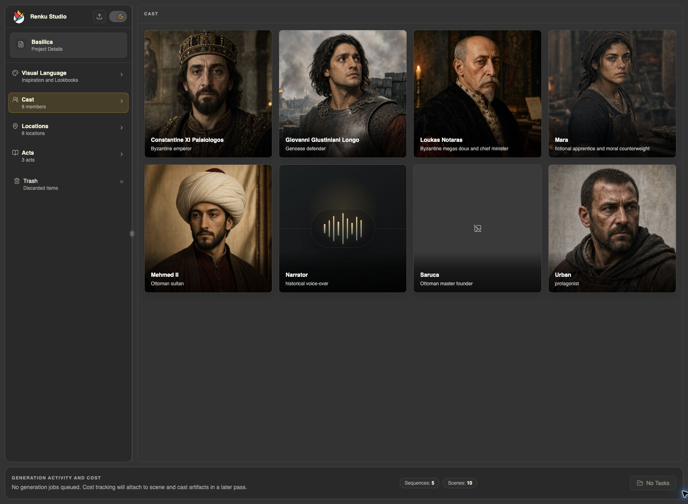
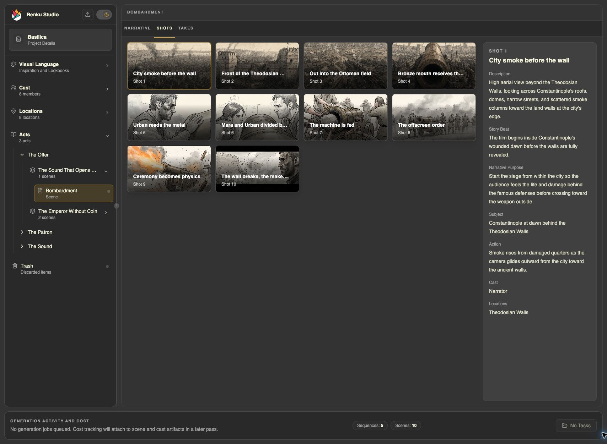

# Renku Studio

Renku Studio is a local-first creative workspace for planning and producing
long-form, AI-assisted films, documentaries, series, and channel-scale video
projects.

It keeps story development, visual language, cast and location continuity,
shot design, media generation, and production assets in one project. The
browser app, command line, and agent workflows all use the same core domain
rules, so creative work remains consistent regardless of where it is changed.



> Renku Studio is under active development. Its current focus is a rigorous
> desktop filmmaking workflow backed by local project data and files.

## Highlights

### Develop the story as a production-ready structure

- Organize a project into acts, sequences, scenes, shots, and takes.
- Keep screenplay content and structured production context together.
- Review screenplay analysis across dramatic energy, stakes, character agency,
  turning points, and scene-level observations.

### Define a durable visual language

- Gather visual Inspiration and turn it into project-native analyses.
- Create Movie and Storyboard Lookbooks covering thesis, palette, grade,
  composition, lighting, texture, camera, and motion.
- Select visual direction once and carry it into later cast, location, shot,
  and generation decisions.



### Maintain cast and location continuity

- Develop Cast Members with profiles, design documents, reference media,
  character sheets, costumes, and voice direction.
- Develop Locations with facts, production design, atmosphere, props, and
  environment media.
- Store durable relationships in the project instead of rebuilding context for
  every prompt or shot.



### Move from narrative intent to individual shots

- Design scene shot lists with subject, action, story beat, narrative purpose,
  cast, locations, and visual references.
- Review a scene as a visual sequence while keeping the selected shot's full
  production context visible.
- Build Shot Video Takes with explicit media dependencies and continuous or
  multi-cut structure.



### Generate media without losing project context

- Use purpose-specific image, video, and audio generation workflows.
- Validate provider inputs against model schemas before execution.
- Estimate cost and require explicit approval before paid provider runs.
- Persist generation specifications, receipts, provenance, and imported output
  as project-owned assets.
- Work with provider catalogs and adapters for services including fal.ai,
  Replicate, OpenAI, Vercel AI Gateway, ElevenLabs, and WaveSpeed.

### Work locally from the UI, CLI, or an agent

- Keep structured project data in SQLite and media in project-relative files.
- Use the `renku` CLI as a human-readable and agent-readable command surface.
- Refresh affected Studio resources when CLI or agent workflows update the
  project.
- Receive structured diagnostics with stable error codes at package boundaries.

## Getting started

### Requirements

- Node.js 24
- pnpm 11.7 or newer in the 11.x line
- Git

The exact supported ranges are declared in the root `package.json`:
Node.js `>=24 <25` and pnpm `>=11.7.0 <12`.

### Install and run

```bash
git clone https://github.com/GoRenku/studio.git
cd studio
pnpm install
pnpm build
pnpm dev:studio
```

Open [http://localhost:5173](http://localhost:5173) in a desktop browser. The
development server uses this canonical host and port.

The initial `pnpm build` compiles the workspace packages consumed by the Studio
app. For later UI-only sessions, `pnpm dev:studio` is enough. Rebuild a shared
package after changing its source, or run its `dev` script in another terminal
while working on it.

### Choose where projects are stored

By default, Renku Studio stores local projects under:

```text
~/renku-studio-projects
```

Set `RENKU_STUDIO_STORAGE_ROOT` to use a different folder:

```bash
RENKU_STUDIO_STORAGE_ROOT=/path/to/projects pnpm dev:studio
```

Project databases, registered media, and durable creative documents live in
that project storage root rather than in this source repository.

### Configure generation providers (optional)

Provider credentials are not required to browse projects, edit project data,
or run the normal local test suite. They are only needed when using the
corresponding live generation provider.

Renku reads provider credentials from exported environment variables first and
then, for keys that are still unset, from:

```text
~/.config/renku/.env
```

Add only the providers you use:

```dotenv
FAL_KEY=...
REPLICATE_API_TOKEN=...
OPENAI_API_KEY=...
AI_GATEWAY_API_KEY=...
ELEVENLABS_API_KEY=...
WAVESPEED_API_KEY=...
```

Do not commit credentials. Live provider tests are opt-in because they can
create paid requests.

## Repository organization

Renku Studio is a pnpm monorepo with clear ownership boundaries:

| Path | Package | Responsibility |
| --- | --- | --- |
| `packages/diagnostics` | `@gorenku/studio-diagnostics` | Structured errors, warnings, locations, and suggestions shared across package boundaries. |
| `packages/engines` | `@gorenku/studio-engines` | Provider catalogs, schema-first validation, live and simulated invocation, and AI provider adapters. |
| `packages/core` | `@gorenku/studio-core` | Domain contracts, validation, commands, projections, SQLite/Drizzle storage, assets, and media-generation rules. |
| `packages/cli` | `@gorenku/studio-cli` | The thin `renku` command surface for people and agents. |
| `packages/studio` | `@gorenku/studio` | React desktop app, local Hono server, browser services, and shared UI primitives. |
| `docs` | — | Accepted product, architecture, CLI, operations, and decision documentation. |
| `plans/active` | — | Current implementation plans and completion checklists. |
| `plans/exploration` | — | Product and technical directions that are still being explored. |

The dependency direction is intentional:

```text
Browser UI ─┐
            ├─> thin adapters ─> studio-core ─> SQLite + project files
CLI/agents ─┘                         │
                                     └─> studio-engines ─> AI providers
```

`studio-core` is the architecture center. It owns domain validation and durable
mutations; the Studio server, CLI, frontend, and agent workflows translate user
intent into core commands rather than implementing parallel business rules.

## Development commands

Run commands from the repository root:

| Command | Purpose |
| --- | --- |
| `pnpm dev:studio` | Start the local Studio app at `localhost:5173`. |
| `pnpm build` | Build all workspace packages in dependency order. |
| `pnpm test` | Run package unit tests. |
| `pnpm test:integration` | Run package integration tests. |
| `pnpm test:e2e:studio:smoke` | Run the isolated Studio browser smoke suite. |
| `pnpm lint` | Run lint checks across the workspace. |
| `pnpm check` | Run type checks, test type checks, lint, architecture checks, and test-partition checks. |
| `pnpm test:final` | Run the complete local verification sequence, including integration and Studio smoke tests. |

Focused scripts are available for individual packages, for example:

```bash
pnpm build:core
pnpm test:engines
pnpm test:cli
pnpm lint:studio
```

## Architecture principles

- **Local-first project ownership.** SQLite owns structured project data;
  project-relative files own media and creative documents.
- **One domain implementation.** UI, server, CLI, and agents share core-owned
  commands, validation, projections, and storage rules.
- **Thin adapters.** HTTP routes, CLI handlers, and React features translate
  intent and render results without duplicating business logic.
- **Explicit generation safety.** Provider payloads are schema-validated, paid
  runs require approval, and outputs retain provenance.
- **Opaque creative artifacts.** Runtime code validates the envelope around
  prompts and media, not their artistic content.
- **Structured failure.** Package-boundary errors use stable, actionable
  diagnostics instead of silent fallbacks.

## Documentation

- [Documentation map](docs/README.md)
- [Architecture overview](docs/architecture/README.md)
- [Layers of responsibility](docs/architecture/layers-of-responsibility.md)
- [Data model and storage](docs/architecture/data-model-and-storage.md)
- [Media generation](docs/architecture/media-generation.md)
- [CLI command reference](docs/cli/commands.md)
- [Local development notes](docs/operations/local-development.md)
- [Architecture decision records](docs/decisions)
