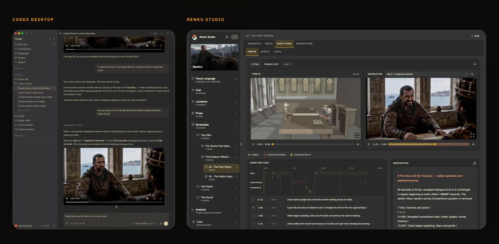

# Renku Studio

Renku Studio is a local-first context engine and visualization app for
agent-assisted filmmaking. Codex provides the agent harness; Renku keeps the
screenplay, visual language, cast, locations, scene Beats, Shot Plans, and media
in a durable project that the agent can read and update through the CLI.

**For installation, tutorials, and usage, start at [gorenku.com](https://gorenku.com).**
This repository is the technical entrypoint for the Studio runtime, CLI, and
shared domain implementation. To work on the code, read [CONTRIBUTING.md](CONTRIBUTING.md).

Copyright © 2026 Kerem Karatal. Renku Studio is licensed under
[GNU AGPLv3](LICENSE). The license covers the software, not the films and other
creative work people make with it. Third-party materials retain their own
licenses. The Renku names and brand assets are covered by the separate
[trademark policy](TRADEMARKS.md).

## How the repositories fit together

- **[studio](https://github.com/GoRenku/studio)** (this repository) owns project
  storage, domain commands, generation engines, the CLI, and the browser app.
- **[studio-skills](https://github.com/GoRenku/studio-skills)** owns the Renku
  agent plugin: filmmaking instructions, workflow references, samples, and
  supporting scripts. Its skills use the separately installed `renku` CLI to
  work with Studio projects; the plugin does not bundle the Studio runtime.

Creative decisions live in the user/agent workflow. Core owns domain validation
and durable changes. When a CLI contract changes, update its callers and the
corresponding skill references in `studio-skills` together.

## Repository organization

| Path | Responsibility |
| --- | --- |
| `packages/core` | Domain contracts, validation, commands, projections, SQLite/Drizzle storage, assets, and generation context. |
| `packages/engines` | Provider catalogs, input schemas, simulation, and provider execution. |
| `packages/diagnostics` | Structured errors, warnings, locations, and suggestions. |
| `packages/cli` | The `renku` command surface for people and agents. |
| `packages/studio` | React browser app, local Hono server, and UI primitives. |
| `packages/website` | The public website at gorenku.com, built with Astro. |
| `docs` | Accepted architecture, CLI, operations, and decision documentation. |
| `plans/active` | Current implementation plans and completion checklists. |
| `plans/exploration` | Open product and technical exploration. |

The CLI and Studio server call core-owned commands. React consumes projections
and sends user intent through the server. Keep business rules in their owning
package rather than duplicating them in UI, HTTP, CLI, or skill code.

## Local configuration and project storage

Manage provider API keys in **Studio Settings**, or in the optional provider
step during first-run setup. Keys are saved in `.env` in the configuration
folder below. The provider credential resolver reads those saved keys;
exported shell API-key variables do not override them.

The first-run UI offers **Use this Project Library** to create the recommended
root folder for movie projects. These are the defaults implemented in core:

| Platform | Configuration folder | Recommended Project Library |
| --- | --- | --- |
| macOS | `$HOME/.config/renku` | `$HOME/Movies/Renku` |
| Linux | `$HOME/.config/renku`, or `$XDG_CONFIG_HOME/renku` when `XDG_CONFIG_HOME` is an absolute path | `$HOME/Videos/Renku` |
| Windows | `%LOCALAPPDATA%\Renku\Studio` | `%USERPROFILE%\Videos\Renku` |

The configuration folder contains `config.yaml`, provider credentials, and
local coordination state. Project databases and media live in the Project
Library. These paths are implemented in
[`packages/core/src/server/config/paths.ts`](packages/core/src/server/config/paths.ts).

The current UI confirms the recommended folder; it does not offer a custom
folder picker. To choose another root, close Studio and run
`renku init <storage-root>` with an absolute path **before completing onboarding**.
This command preserves existing configuration; it does not relocate an existing
library.

## CLI for technical work

Use `renku --help` for the command overview and the
[CLI reference](docs/cli/commands.md) for complete arguments and document shapes.
After building this checkout, invoke its CLI from the repository root with
`node packages/cli/dist/cli.js --help`; replace `renku` in the examples below
with `node packages/cli/dist/cli.js` to use your local build.

Angle-bracket values are placeholders to replace with real project names, IDs,
paths, or provider identifiers.

| Command | Purpose |
| --- | --- |
| `renku about` | Report product and CLI package information. |
| `renku init <storage-root>` | Create configuration, or report the existing configuration. |
| `renku create <project-name> --title <title>` | Create a movie project and make it the current authoring project. |
| `renku project open <project-name>` | Set the current authoring project. |
| `renku project current --json` | Inspect the current authoring project. |
| `renku project close` | Clear the current authoring project. |
| `renku project migrate <project-name>` | Apply pending project database migrations. |
| `renku studio start` | Start the local Studio web application. |
| `renku studio stop` | Stop the local Studio server. |
| `renku studio server status --json` | Inspect the local Studio server status. |
| `renku studio current --json` | Read the current browser focus and context. |
| `renku project select <project-name>` | Request that Studio display a project. |
| `renku director context --json` | Read project readiness and directing context. |
| `renku info show --json` | Inspect project information. |
| `renku settings show --json` | Read Project Settings, distinct from global provider credentials. |
| `renku screenplay show --json` | Read the screenplay. |
| `renku generation context --purpose <purpose> --target <target> --json` | Read core-owned context for a generation purpose and target. |
| `renku generation schema show --provider <provider> --model <model> --json` | Inspect a provider model's input schema. |
| `renku generation validate --file <request.json> --json` | Validate a generation request document. |

The persisted **authoring project** and the browser's **current selection** are
separate: opening a project in the CLI is not the same as selecting it in Studio.
The reference also covers cast, locations, props, Lookbooks, scene Beats, Shot
Lists, Blender Previs, media attachment, provider execution, and Trash.

## Development commands

Contributor prerequisites and initial setup are in [CONTRIBUTING.md](CONTRIBUTING.md).
Run these from the repository root:

| Command | Purpose |
| --- | --- |
| `pnpm build` | Build diagnostics, engines, core, Studio, and CLI in dependency order. |
| `pnpm dev:studio` | Start the Studio development server at `http://localhost:5173`. |
| `pnpm dev:core` | Watch and compile core while developing. |
| `pnpm test` | Run the five runtime packages' unit-test suites. |
| `pnpm test:integration` | Run core, CLI, and Studio integration tests. |
| `pnpm test:e2e:studio:smoke` | Build browser-test dependencies and run the isolated Studio smoke suite. |
| `pnpm lint` | Lint the five runtime packages. |
| `pnpm check` | Run type checks, test type checks, lint, architecture checks, test-partition checks, and release-tool tests. |
| `pnpm test:final` | Run `check`, unit tests, integration tests, and Studio smoke tests. |
| `pnpm dev:website` | Start the website development server. |
| `pnpm build:website` | Build the website separately. |
| `pnpm --filter @gorenku/website check` | Run Astro checks for the website. |

Focused runtime scripts include `pnpm build:core`, `pnpm test:engines`,
`pnpm test:cli`, and `pnpm lint:studio`. The root runtime build and verification
scripts do not include the website. See [`package.json`](package.json) for the
exact script definitions. Creating and publishing releases is maintainer work,
not part of the contributor workflow.

## Documentation

- [Contributor guide](CONTRIBUTING.md)
- [Documentation map](docs/README.md)
- [Architecture overview](docs/architecture/README.md)
- [Layers of responsibility](docs/architecture/layers-of-responsibility.md)
- [Data model and storage](docs/architecture/data-model-and-storage.md)
- [Media generation](docs/architecture/media-generation.md)
- [CLI command reference](docs/cli/commands.md)
- [Local development notes](docs/operations/local-development.md)
- [Parallel worktrees and agent-assisted integration](docs/development/parallel-worktree-integration.md)
- [Architecture decision records](docs/decisions)
- [Renku agent skills](https://github.com/GoRenku/studio-skills)
