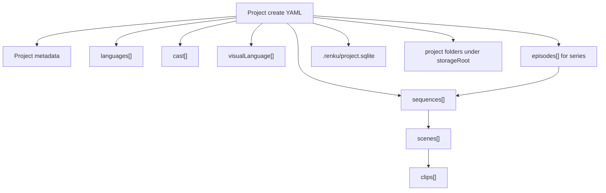

# ProjectSetup YAML Structure

Date: 2026-05-05

Status: architecture decision

## Purpose

This document defines the YAML shape passed to `renku create` when creating
a new Renku Studio project.

The YAML is a temporary **ProjectSetup**, not an import/export format and not a
long-term project state file.

The intended flow is:

```text
narrative, references, user direction
  -> agent skill creates a ProjectSetup YAML
  -> agent calls renku create
  -> studio-core/node parses the YAML as internal ProjectSetup
  -> studio-core creates the project under the configured storage root
  -> studio-core creates .renku/project.sqlite and the initial folder structure
  -> Renku Studio opens the initialized project
```

After creation, durable project state lives in SQLite and project files.

The YAML has no lifecycle after the create command. It should not be copied into
the project, watched, reloaded, or edited to keep the project synchronized.

Later changes should use specific Renku CLI commands or Renku Studio UI actions.

Examples:

```bash
renku cast add ...
renku visual-language add ...
renku sequence add ...
renku scene update ...
renku clip add ...
```

## Core Decision

The create YAML answers one question:

> What initial project scaffold should Renku Studio create?

It should include only the initial creative/narrative outline that an agent can
reasonably extract from narrative material:

- project title, project name, format, logline, and summary;
- whether this is a standalone movie or a series;
- initial episodes for a series;
- initial base/supported language metadata, if known;
- initial cast list;
- initial visual language descriptions;
- initial narrative spine: sequences, scenes, and clips;
- important titles, names, summaries, descriptions, and intent notes.

It should not decide detailed production relationships.

For example, the YAML should not say which cast member appears in which clip, or
which visual language is bound to which scene. Those relationships are
authored later through explicit commands and UI actions.

The rule:

> Create YAML starts the project. SQLite owns the project after creation.

## Command Shape

The command should be:

```bash
renku create --file project.yaml
renku create --file project.yaml --cover cover.png
```

The command should not accept a positional project name or an arbitrary project
folder path.

Project location should be deterministic:

```text
configured storageRoot + project.name
```

The `storageRoot` is configured in the global Renku config created by:

```bash
renku init <storage-root>
```

The config file lives at `~/.config/renku/config.yaml`, uses camelCase keys, and
must contain an explicit `storageRoot`. There is no default storage root.

If the target project folder already exists, creation should fail with a clear
error unless a future explicit recovery/resume flow is designed.

If `--cover` is provided, the source image is copied into the created project as
`cover.png`. The cover image path is command input, not a field in the create
YAML.

## Responsibility Split

`studio-cli` should:

- parse command arguments;
- pass the setup file path to `ProjectDataService`;
- print a human-readable and machine-readable creation report.

`studio-core` should:

1. Validate the YAML shape.
2. Resolve the configured `storageRoot`.
3. Read required `project.name`.
4. Allocate the project folder path.
5. Create `.renku/project.sqlite`.
6. Generate durable opaque IDs.
7. Create project, series, episode, language, cast, visual language, sequence,
   scene, and clip records for whatever the YAML provides.
8. Create the initial user-friendly folder structure.
9. Return a creation report.

The CLI should not implement creation business rules itself.

## Deterministic Allocation

The YAML should not require agents to invent unique keys.

Agents are good at extracting structure and naming things. They should not need
to solve ID allocation.

`studio-core` should generate:

- durable database IDs;
- initial ordering;
- user-friendly folder names;
- any temporary creation handles needed for diagnostics.

The exact algorithm can be implemented later, but the rules should be:

- durable database IDs are opaque;
- no code may parse durable IDs to infer meaning;
- folder names may be human-readable slugs;
- folder names are not identity;
- ordering comes from array order in the YAML;
- if two sibling items have the same title, `studio-core` should allocate unique
  folder names deterministically, for example with an ordinal suffix;
- validation should not require the agent to supply unique keys.

Example folder allocation:

```text
Sequences/
  01-the-young-sultans-obsession/
  02-the-logistics-of-impossible-weight/

Cast/
  001-mehmed-ii/
  002-mehmed-ii-2/
```

The exact folder names are user-friendly implementation details.

SQLite stores the real identity and relationships.

## Non-Goals

The create YAML should not contain:

- cover image paths;
- narrative file paths;
- durable project state after creation;
- SQLite IDs;
- Renku canonical IDs;
- agent-authored keys for cross references;
- relationship references such as `castRefs` or `visualLanguageRefs`;
- clip-to-cast bindings;
- visual language bindings;
- durations or target durations;
- generation tasks;
- generation records;
- provider runs;
- takes;
- selected or pinned assets;
- generation recipes;
- recipe workflow definitions;
- prompt packages;
- queue state;
- budget spend or actual cost records;
- timeline assembly state;
- export state.

Those belong in SQLite, project files, generation recipes, or runtime systems
after the project has been created.

## Design Principles

- Keep the YAML focused on the initial scaffold.
- Every section except `kind`, `version`, `project.title`, and `project.type`
  should be optional.
- Missing cast, visual language, languages, sequences, scenes, or clips should
  not fail creation.
- Include important narrative content such as names, titles, loglines,
  summaries, descriptions, and short intent notes.
- Do not include durations.
- Do not include detailed production relationships.
- Do not include generation execution state.
- Use array order as the initial display/order value.
- Let `studio-core` allocate durable database IDs and filesystem paths.
- Do not infer relationships from matching names.

## Entity Hierarchy



## Minimal Shape

Only the project title and project type are required.

```yaml
kind: renku.projectSetup
version: 0.1.0

project:
  title: Preparation of the Siege of Constantinople
  type: standaloneMovie
```

Everything else can be authored later.

## Recommended Shape

```yaml
kind: renku.projectSetup
version: 0.1.0

project:
  name: constantinople-movie
  title: Preparation of the Siege of Constantinople
  type: standaloneMovie
  format: historical_documentary
  baseLanguage: en-US
  logline: A documentary about how Mehmed II prepared the machine that made Constantinople vulnerable.
  summary: >
    The movie follows the strategic, logistical, and psychological preparation
    for the siege of Constantinople.

languages:
  - localeTag: en-US
    displayName: English
    isBase: true
  - localeTag: tr-TR
    displayName: Turkish

visualLanguage:
  - name: Ottoman court miniature influence
    intent: >
      A controlled visual language inspired by Ottoman court miniature painting,
      restrained documentary lighting, and historical materials.
    summary: Muted golds, deep reds, formal court staging, and precise textile detail.

cast:
  - name: Mehmed II
    kind: character
    role: Young Ottoman sultan
    shortDescription: Young ruler preparing to take Constantinople.

sequences:
  - title: The Young Sultan's Obsession
    shortTitle: Ambition
    summary: Mehmed inherits an old imperial dream and turns it into policy.
    scenes:
      - title: A Throne Facing an Ancient City
        summary: The film establishes Mehmed's accession and Constantinople's symbolic weight.
        clips:
          - title: The New Sultan
            summary: Mehmed is introduced as young, controlled, and intensely focused.
            visualIntent: Quiet court staging around a ruler already looking beyond the room.
```

## Field Notes

### `kind`

Required.

Identifies the file as a Renku Studio project creation document.

```yaml
kind: renku.projectSetup
```

### `version`

Required.

Schema version for this creation YAML shape.

```yaml
version: 0.1.0
```

### `project`

Required.

Basic scaffold metadata.

```yaml
project:
  name: constantinople-movie
  title: Preparation of the Siege of Constantinople
  type: standaloneMovie
  format: historical_documentary
  baseLanguage: en-US
  logline: A documentary about how Mehmed II prepared the machine that made Constantinople vulnerable.
  summary: >
    The movie follows the strategic, logistical, and psychological preparation
    for the siege of Constantinople.
```

Recommended fields:

- `name`: required kebab-case project short name. It is used as the project
  folder name under the configured `storageRoot`.
- `title`: display title. This is required.
- `type`: `standaloneMovie` or `series`. This is required because Renku Studio should
  create series metadata from the beginning when the project is a series.
- `format`: broad format, such as `historical_documentary`, `fiction_short`,
  `explainer`, or `essay_film`.
- `baseLanguage`: optional BCP 47-style locale tag.
- `logline`: compact one-sentence premise.
- `summary`: short project-level summary.

`project.name` is not a path.

It is a project name used with the configured `storageRoot` to allocate the
folder.

### `languages`

Optional.

Represents basic language metadata known at creation time.

This is intentionally light. Detailed language configuration, localization
levels, subtitles, dubbed audio, and lip-sync support are configured later.

```yaml
languages:
  - localeTag: en-US
    displayName: English
    isBase: true

  - localeTag: tr-TR
    displayName: Turkish
```

Recommended language fields:

- `localeTag`: BCP 47-style locale tag.
- `displayName`: user-facing language name.
- `isBase`: whether this is the base language.

Rules:

- If `project.baseLanguage` is present, `studio-core` should create basic base
  language metadata for that locale.
- If `languages` is present, `studio-core` should create basic language metadata
  for those entries.
- If neither `project.baseLanguage` nor `languages` is present, creation should
  still succeed and the user can configure language later.
- If `languages` is present and no item has `isBase: true`, creation should
  still succeed and the user can configure the base language later.
- Detailed localization levels are out of scope for this YAML.

### `visualLanguage`

Optional.

Represents initial Visual Language descriptions.

This should describe artistic direction, not generation prompts, recipe
configuration, or bindings.

Example:

```yaml
visualLanguage:
  - name: Ottoman court miniature influence
    intent: >
      A controlled, richly detailed visual language inspired by Ottoman court
      miniature painting, restrained documentary lighting, and historical
      materials.
    summary: Muted golds, deep reds, formal court staging, and precise textile detail.
```

Recommended visual language fields:

- `name`: display name.
- `intent`: human-readable creative direction summary.
- `summary`: compact navigation summary.

The create command should create visual language records and
user-friendly folders.

It should not bind those visual language entries to cast members, scenes, clips,
or episodes.

### `cast`

Optional.

Represents initial recurring production subjects.

For documentaries, "cast" should be understood broadly. It can include:

- historical figures;
- narrators;
- recurring experts;
- armies;
- cities;
- buildings;
- symbolic entities;
- maps or recurring visual subjects.

Example:

```yaml
cast:
  - name: Mehmed II
    kind: character
    role: Young Ottoman sultan
    shortDescription: Young ruler preparing to take Constantinople.
```

Recommended cast fields:

- `name`: display name.
- `kind`: `character`, `narrator`, `location`, `object`, `group`, or `other`.
- `role`: plain-language production or story role.
- `shortDescription`: compact context for the project.

### `sequences`

Optional.

Sequences are the largest v1 story sections for a standalone movie.

For a series, sequences can also appear inside each episode.

There are no duration fields.

Example:

```yaml
sequences:
  - title: The Logistics of Impossible Weight
    shortTitle: Logistics
    summary: The Ottoman war machine makes the impossible physically movable.
    scenes: []
```

Recommended sequence fields:

- `title`: full title.
- `shortTitle`: compact title for navigation.
- `summary`: short structural summary.
- `scenes`: optional ordered list of scenes.

Ordering comes from array position.

### `scenes`

Optional.

Scenes live inside sequences.

There are no duration fields.

Example:

```yaml
scenes:
  - title: The Cannon Begins to Move
    summary: The bombard stops being an invention and becomes a campaign.
    clips: []
```

Recommended scene fields:

- `title`: display title.
- `summary`: compact scene summary.
- `clips`: optional ordered list of clips.

### `clips`

Optional.

Clips live inside scenes.

Clips are the smallest first-class structural unit in this create YAML.

There is no `beats` level in this version.

There are no duration fields.

Example:

```yaml
clips:
  - title: The Sleeping Monster
    summary: The viewer understands the cannon's impossible scale.
    visualIntent: Slow reveal of the enormous bombard under torchlight.
```

Recommended clip fields:

- `title`: display title.
- `summary`: short purpose or action of the clip.
- `visualIntent`: optional short visual intent. This is not a generation prompt.

The create command should use these fields to create initial clip records and
user-friendly folders.

It should not generate media or queue generation tasks.

## Series Shape

Series support should be part of the initial creation model.

Use `project.type: series` and provide `episodes`.

```yaml
kind: renku.projectSetup
version: 0.1.0

project:
  name: conquest-series
  title: The Fall of Constantinople
  type: series
  format: historical_documentary_series
  baseLanguage: en-US
  logline: A series about the people, machines, and decisions that shaped 1453.

episodes:
  - title: The Cannon Founder
    episodeNumber: 1
    summary: Urban's engineering promise becomes a weapon of empire.
    sequences:
      - title: The Offer
        summary: The cannon founder searches for a patron.

  - title: The Walls
    episodeNumber: 2
    summary: Constantinople's defenses become the central problem of the siege.
```

Recommended episode fields:

- `title`: display title.
- `episodeNumber`: optional display/order number.
- `summary`: compact episode summary.
- `sequences`: optional ordered list of sequences for that episode.

For `project.type: series`, top-level `sequences` may be omitted.

If both top-level `sequences` and episode sequences are present, `studio-core`
should fail with a clear validation error until a concrete meaning is designed.

## Complete Movie Example

```yaml
kind: renku.projectSetup
version: 0.1.0

project:
  name: constantinople-movie
  title: Preparation of the Siege of Constantinople
  type: standaloneMovie
  format: historical_documentary
  baseLanguage: en-US
  logline: A historical documentary about how Mehmed II prepared the machine that made Constantinople vulnerable.
  summary: >
    The film follows the strategic, logistical, and psychological preparation
    that turned an old imperial dream into a campaign.
  aspectRatio: "16:9"
  resolution:
    width: 1920
    height: 1080

languages:
  - localeTag: en-US
    displayName: English
    isBase: true

  - localeTag: tr-TR
    displayName: Turkish

visualLanguage:
  - name: Ottoman court miniature influence
    intent: >
      A restrained historical documentary look influenced by Ottoman miniature
      painting, court textiles, muted golds, deep reds, and formal staging.
    summary: Formal court staging, miniature-inspired composition, controlled color.

  - name: Night foundry lighting
    intent: >
      Smoke, sparks, torchlight, damp stone, and heavy bronze surfaces for
      sequences involving cannon casting and transport.
    summary: Industrial night lighting with smoke, sparks, and bronze.

cast:
  - name: Mehmed II
    kind: character
    role: Young Ottoman sultan
    shortDescription: Young ruler preparing to take Constantinople.

  - name: Constantine XI Palaiologos
    kind: character
    role: Byzantine emperor
    shortDescription: Emperor defending the city under impossible pressure.

  - name: Theodosian Walls
    kind: location
    role: Recurring visual subject
    shortDescription: Ancient land walls guarding Constantinople from the west.

  - name: Urban
    kind: character
    role: Cannon founder
    shortDescription: Engineer associated with Mehmed's giant bombard.

  - name: Narrator
    kind: narrator
    role: Voiceover
    shortDescription: Grave, cinematic documentary narrator.

sequences:
  - title: The Young Sultan's Obsession
    shortTitle: Ambition
    summary: Mehmed inherits an old imperial dream and turns it into policy.
    scenes:
      - title: A Throne Facing an Ancient City
        summary: The film establishes Mehmed's accession and Constantinople's symbolic weight.
        clips:
          - title: The New Sultan
            summary: Mehmed is introduced as young, controlled, and intensely focused.
            visualIntent: Quiet court staging around a ruler already looking beyond the room.

          - title: The City Across the Water
            summary: Constantinople appears as both prize and obstacle.
            visualIntent: The city and walls are treated as a living strategic problem.

  - title: The Logistics of Impossible Weight
    shortTitle: Logistics
    summary: The Ottoman war machine makes the impossible physically movable.
    scenes:
      - title: The Cannon Begins to Move
        summary: The bombard stops being an invention and becomes a campaign.
        clips:
          - title: The Sleeping Monster
            summary: The viewer understands the cannon's impossible scale.
            visualIntent: The cannon rests in shadow, too large to feel movable.

          - title: Ropes, Axles, Timber
            summary: Preparation becomes organized labor.
            visualIntent: Teams of workers, timber frames, ropes, mud, and torchlight.

          - title: The Weight Refuses
            summary: The machine resists movement and turns logistics into drama.
            visualIntent: The first failed pull shows the violence of mass and friction.
```

## Validation Rules

The create command should fail with structured `PROJECT_SETUP...` diagnostics
when:

- `kind` is not `renku.projectSetup`;
- `version` is missing or unsupported;
- `project.name` is missing;
- `project.title` is missing;
- `project.type` is missing;
- `project.type` is not `standaloneMovie` or `series`;
- `project.name` is present but is not a valid project name;
- a known field has the wrong type.

The create command should fail with structured `PROJECT_DATA...` diagnostics
when the resolved project folder already exists or a required filesystem/database
operation fails.

Unknown YAML fields are warnings, not errors. They are ignored and must never
create database columns, DTO fields, or schema obligations.

Misspelled required fields are reported as both:

- a missing required field error for the intended field;
- an unknown field warning for the misspelled key.

The create command should not fail when:

- `languages` is missing;
- `visualLanguage` is missing;
- `cast` is missing;
- `sequences` is missing;
- `episodes` is missing for a `standaloneMovie`;
- a sequence has no scenes;
- a scene has no clips.

The create command should not:

- infer cast relationships from names;
- infer visual language relationships from nearby text;
- infer ordering from titles;
- resolve aliases as identities;
- synthesize missing cast entries;
- synthesize missing visual language entries;
- generate media;
- queue generation tasks;
- treat this YAML as project state after creation.

## Creation Output

After a successful create, `studio-core` should create:

- the project folder under configured `storageRoot`;
- `.renku/project.sqlite`;
- project metadata rows;
- series and episode rows, when `project.type` is `series`;
- supported language rows, if language metadata was provided;
- visual language rows, if visual language metadata was provided;
- cast member rows, if cast metadata was provided;
- sequence, scene, and clip rows, if narrative spine metadata was provided;
- user-friendly folders for the created project structure;
- a creation report suitable for CLI and agent consumption.

Example report:

```json
{
  "projectName": "constantinople-movie",
  "projectPath": "/configured/storageRoot/constantinople-movie",
  "databasePath": "/configured/storageRoot/constantinople-movie/.renku/project.sqlite",
  "coverPath": "/configured/storageRoot/constantinople-movie/cover.png",
  "created": {
    "languages": 2,
    "castMembers": 5,
    "visualLanguage": 2,
    "episodes": 0,
    "sequences": 2,
    "scenes": 2,
    "clips": 5
  }
}
```

The report should help the agent continue with normal CLI commands.

It should not encourage the agent to keep editing the YAML.

## Recommendation For V0

For V0, keep the create YAML plain and forgiving:

- required `kind`;
- required `version`;
- required `project.title`;
- required `project.type`;
- required `project.name`;
- optional `languages`;
- optional `visualLanguage`;
- optional `cast`;
- optional `sequences`;
- optional `episodes` for series;
- no agent-authored keys;
- no relationship refs;
- no durations;
- no generation state;
- no recipes;
- no cover path;
- no narrative file path;
- no attempts to make this file a source of truth.

This gives agents a simple way to turn a narrative into an initial Renku Studio
project scaffold without turning YAML into a second state system.
